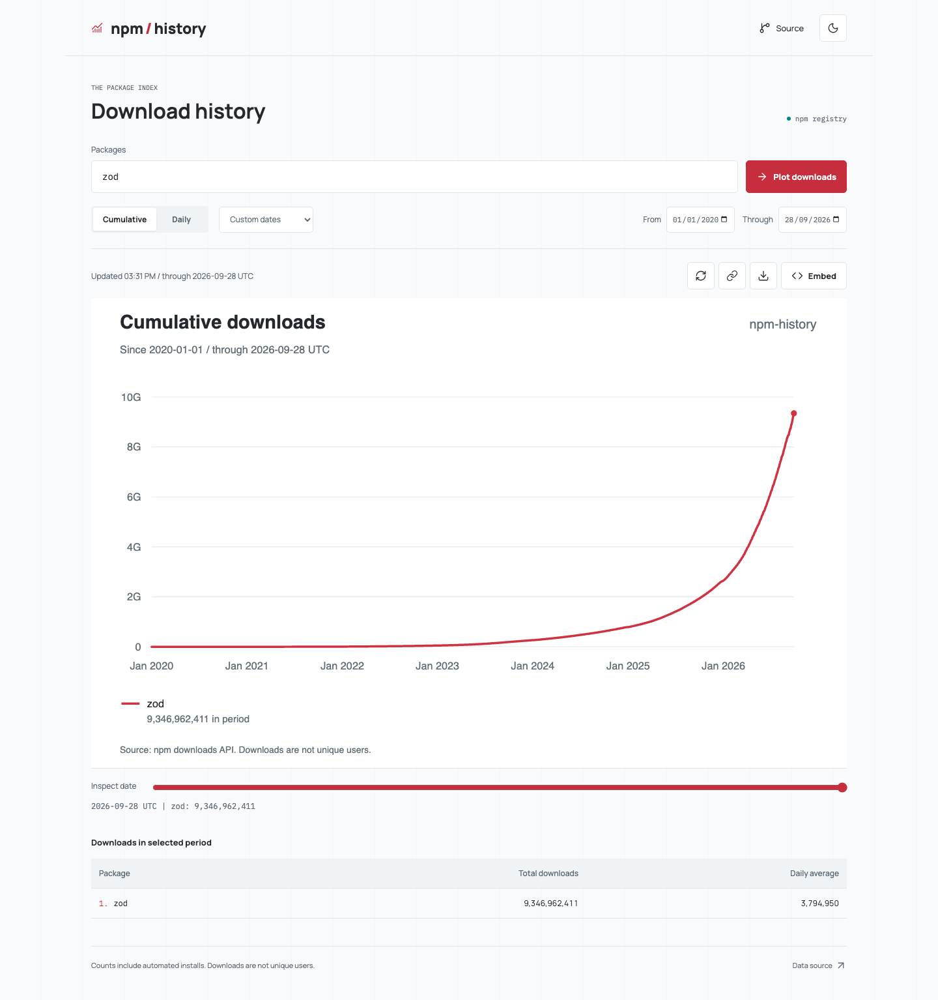

# npm-history

Cumulative npm download charts, built for sharing.

Compare up to three packages, inspect daily or cumulative counts, and export a
standalone SVG or a live README embed. No account or API key required.

**[Open npm-history](https://npm-history.pages.dev)**



Preview captured from npm's public API; not a live embed.

## Run Locally

Requires Node.js 22.13+, 24.x or 26+ and npm (Node.js 23/25 are unsupported).

```sh
npm ci
npm run build
npm start
```

Open http://127.0.0.1:4317. Set `PORT` to choose a different port.
`npm run dev` builds once and watches the compiled server; rerun `npm run build`
after source edits and refresh the browser.

## Live Embeds

Open [npm-history.pages.dev](https://npm-history.pages.dev), then use **Embed** to copy Markdown.
The generated URL fixes the start date and omits the end date, so the cumulative
chart grows through yesterday as npm publishes data:

```md
[](https://npm-history.pages.dev/?package=zod&start=2020-01-01)
```

[](https://npm-history.pages.dev/?package=zod&start=2020-01-01)

Use `packages=zod,valibot` for comparisons and `theme=dark` for a dark SVG.
**Share** retains both dates for a reproducible selection; **Download** saves the
currently selected chart. A localhost embed is not accessible from GitHub.
The public service is a free-tier beta: availability is subject to Cloudflare
quotas and npm availability. Cold multi-year charts can take tens of seconds;
cached charts are much faster. See [deployment limits](docs/deployment.md).

## What the Numbers Mean

- Cumulative means the sum **since the selected start date**, not necessarily lifetime.
- All dates are inclusive UTC days. Today is excluded because its data is incomplete.
- npm documents historical data from January 10, 2015. Older package history is not available.
- The 18-month restriction is per request, not retention. This app joins contiguous 365-day requests.
- Missing or malformed days produce an explicit error, never an invented zero.
- Downloads include CI, bots, reinstalls and dependency installations. They are not unique users.
- npm may lag behind yesterday. Choose an earlier end date if a range is not yet available.
- Hosted charts are edge-cached for an hour; the local Node service uses an in-process cache. Provider-side revisions can change historical totals.

## Development

```sh
npm test
npm run typecheck
npm run lint
npm run build
npx playwright install chromium
npm run test:e2e
npm audit --audit-level=low
```

Tests mock npm. The browser suite runs the actual app against a local synthetic
history provider and checks desktop/mobile chart pixels, layout, URL state,
clipboard, downloads and error recovery. `npm run format` formats source files.

The project uses TypeScript, Node's HTTP server and fetch, Zod, D3, esbuild,
Vitest and Playwright. Fonts and icons are served locally; there is no analytics.

## References

- [MVP specification](docs/spec.md)
- [API contract](docs/api.md)
- [Architecture and operations](docs/architecture.md)
- [Deployment](docs/deployment.md)
- [Contributing](CONTRIBUTING.md)
- [Third-party notices](THIRD_PARTY.md)

Inspired by [Star History](https://github.com/star-history/star-history):
URL-first sharing, comparisons and server-rendered README images. This is an
independent implementation with no copied Star History source or assets and no
affiliation with Star History or npm. The existence of a market gap has not been
exhaustively established.
